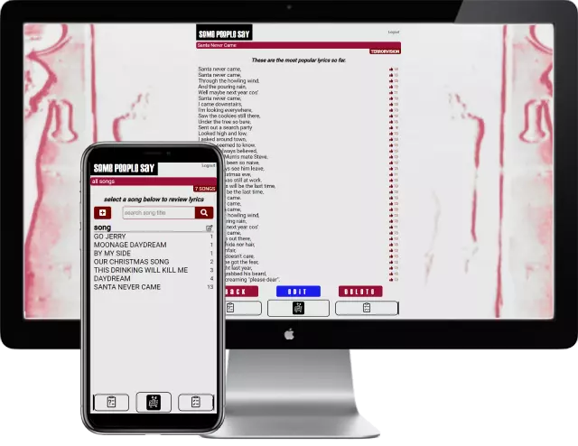

Project Link: [some People Say](bit.ly/SomePeopleSay)

# Some People Say

<!-- A little info about your project and/ or overview that explains **what** the project is about. -->

An app built solely for fans to collaborate missing lyrics to songs. Based on a voting system to produce the lyrics that are most likely to be correct.

## Motivation

<!-- A short description of the motivation behind the creation and maintenance of the project. This should explain **why** the project exists. -->

A number of fans, including myself, wanted to know lyrics to some of the lesser known song lyrics. This is what I came up with to try and work out the lyrics.

## Code

Built in Node, Express and SASS.

<!-- ## Screenshots -->

<!-- Include logo/demo screenshot etc. -->

<!--  -->

<!-- ## Tech/framework used

Ex. -

<b>Built with</b>

- [Electron](https://electron.atom.io) -->

<!-- ## Features

What makes your project stand out? -->

<!-- ## Future Features

- MERN stack
- User authentication
- Lotto draws updated via an external API
- Payments with PayPal
- Random number generator
- Ball statistics
- Player statistics -->

<!-- ## Code Example

Show what the library does as concisely as possible, developers should be able to figure out **how** your project solves their problem by looking at the code example. Make sure the API you are showing off is obvious, and that your code is short and concise. -->

<!-- ## Installation

Provide step by step series of examples and explanations about how to get a development env running. -->

<!-- ## API Reference

Depending on the size of the project, if it is small and simple enough the reference docs can be added to the README. For medium size to larger projects it is important to at least provide a link to where the API reference docs live.

## Tests

Describe and show how to run the tests with code examples. -->

<!-- ## How to use? -->

<!-- If people like your project they’ll want to learn how they can use it. To do so include step by step guide to use your project. -->

<!-- 1.Player data is added in users.json
2.Every draw is added in draws.json -->

```javascript
// {
// 		"date": "19/02/2022",
// 		"day": "Saturday",
// 		"numbers": [33,34,44,50,56,57],
// 		"bonusBall": 26,
// 		"winner": false
// 	}
```

<!-- 3.Countdown timer is reset in var nextDraw located in countdownTimer function -->

```javascript
// const nextDraw = 'Feb 23, 2022 19:45:00';
```

<!-- 4.Winner is added in draw object -->

```javascript
// {
// 		"date": "19/02/2022",
// 		"day": "Saturday",
// 		"numbers": [33,34,44,50,56,57],
// 		"bonusBall": 26,
// 		"winner": "WINNERS NAME"
// 	}
```

<!-- 5.To begin a new game, add start date in startDateInput.mjs -->

```javascript
// const gameStartDates = [
// 	'08/08/2020',
// 	'30/09/2020',
// 	'26/12/2020',
// 	'10/02/2021',
// 	'24/03/2021',
// 	'12/05/2021',
// 	'10/07/2021',
// 	'11/08/2021',
// 	'09/10/2021',
// 	'13/11/2021',
// 	'18/12/2021',
// 	'02/02/2022',
// ];
```

## Contact

If you want to contact me you can reach me at [daveperry.tech](https://daveperry.tech)

<!-- [loopy lotto repo](https://github.com/your_username/repo_name) -->

## License

<!-- A short snippet describing the license (MIT, Apache etc) -->

Distributed under the MIT License. See [LICENSE.txt](LICENSE.txt) for more information.

<!-- MIT © [Dave Perry]() -->
